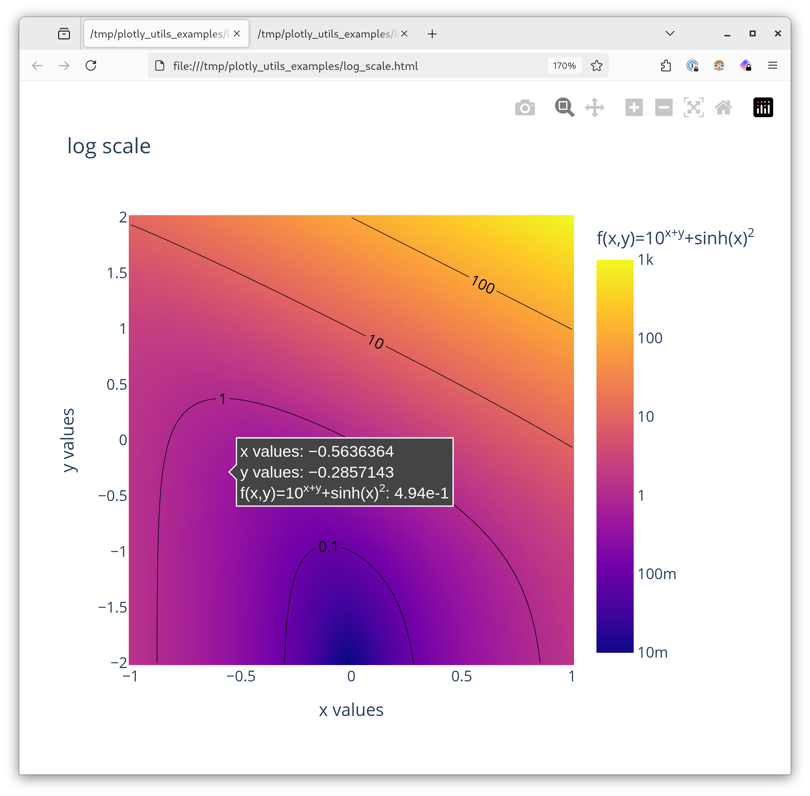

# Plotly utils

My personal package of utilities for doing nice plots with [Plotly](https://plotly.com/python/). Examples: logarithmic color scales, grouped legends, scatter histograms, etc.

## Installation

```
pip3 install git+https://github.com/SengerM/plotly_utils
```

## Examples

See the [examples](examples) directory.


